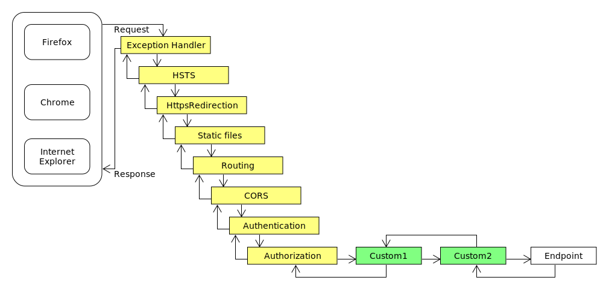

# Learn ASP.NET Core MVC (.NET 6) - Full Course
## by Bhrugen Patel

Learn the basics of .NET Core (.NET 6) and then build a simple CRUD application with MVC in this tutorial.

## Resources
- Video tutorial: https://www.youtube.com/watch?v=hZ1DASYd9rk
- Code repo: https://github.com/bhrugen/Bulky/tree/3d83a49c70ebf3ed043e9415a0dcd782f62f5bf7

## Topics covered
- Fundamentals of ASP.NET Core
- Changes in .NET 6
- Entity Framework Core
- CRUD operations
- Client & server validations
- TempData
- Error solving
- Deploy to Azure

## Tools
- .NET 6 Framework
- Visual Studio Code
- mssql extension (SQL Server) for VS Code

## .NET Core Roadmap
- 2002: WebForms
- 2009: MVC
- 2016: .NET Core
|Date       |.NET           |Support    |
|--         |--             |--         |
|June 2006  |.NET Core 1.0  |           |
|Aug 2018   |.NET Core 2.0  |           |
|Sep 2019   |.NET Core 3.0  |           |
|Dec 2019   |.NET Core 3.1  |LTS        |
|Nov 2020   |.NET Core 5.0  |           |
|Nov 2021   |.NET Core 6.0  |LTS        |
|Nov 2022   |.NET Core 7.0  |           |
|Nov 2023   |.NET Core 8.0  |LTS        |

### Dependency injection 

### NET Core Pipeline

### MVC architecture
- **Model**: represents the shape of the data
- **View**: Represents the user interface
- **Controller**: Handles the user request and acts as an interface between Model and View

### Tag helpers
- Enable server-side code to participate in creating and rendering HTML elements in Razor files
- .NET Core equivalent of HTML helpers in classic .NET MVC
- Moddeled after Angular directive functionality

### Action Result
|ActionResult           |Helper                                 |
|--                     |--                                     |
|ContentResult          |                                       |
|FileContentResult      |                                       |
|NotFoundResult         |                                       |
|PageResult             |                                       |
|PartialResult          |                                       |
|RedirectToPageResult   |RedirectTopage                         |
|                       |RedirectToPagePermanent                |
|                       |RedirectToPagePreserveMethod           |
|                       |RedirectToPagePreserveMethodPermanent  |
|ViewComponentResult    |                                       |