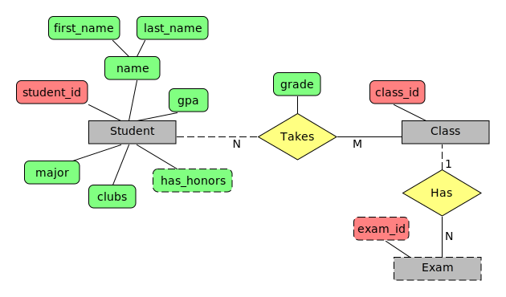
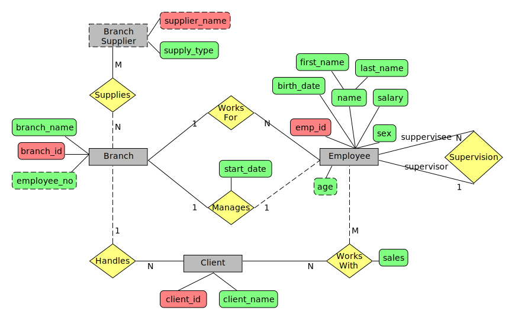

# SQL Tutorial - Full Database Course for Beginners
## by Mike Dane (Giraffe Academy)
In this course, we'll be looking at database management basics and SQL using the MySQL RDBMS.  
The course is designed for beginners to SQL and database management systems, and will introduce common database management topics.  
Throughout the course we'll be looking at various topics including schema design, basic C.R.U.D operations, aggregation, nested queries, joins, keys and much more.

## Resources
- Video tutorial: https://www.youtube.com/watch?v=HXV3zeQKqGY&t=17s
- Sample Company Database: https://www.giraffeacademy.com/databases/sql/creating-company-database/

## Summary
- [What is a database?](#database-management-systems)
- [Tables and keys](#tables-and-keys)
    - [Primary keys](#primary-keys)
    - [Foreign keys](#foreign-keys)
- [SQL basics](#structured-query-language-sql)
- [ER Diagrams](#er-diagrams)
    - [Designing an ER diagram](#designing-an-er-diagram)
- [Company database](#company-database)
    - [Company data requirements](#company-data-requirements)
    - [Company ER diagram](#company-er-diagram)
    - [Company Schema](#company-schema)
    - [Company tables](#company-tables)

## Database Management Systems
DBMS - a special software program that helps users create and maintain a database
- Makes it easy to manage large amounts of information
- Handles security
- Backups
- Importing/exporting data
- Concurrency
- Interacts with software applications

### C.R.U.D.
The main operations for working with a database:
- Create
- Read/Retrieve
- Update
- Delete

### Relational databases (SQL)
Organize data into one or more tables
- Each table has columns and rows
- A unique key identifies each row

Student table
|*ID#   |Name   |Major      |
|--     |--     |--         |
|1      |Jack   |Biology    |
|2      |Kate   |Sociology  |
|3      |Claire |English    |
|4      |John   |Chemistry  |

Users table
|*Username  |Password   |Email  |
|--         |--         |--     |
|jsmith22   |wordpass   |...    |
|catlover45 |apple223   |...    |
|gamerkid   |...        |...    |
|giraffe    |...        |...    |

- Relational Database Management Systems (RDBMS)
    - help users create and maintain a database
        - mySQL, Oracle, postgreSQL, mariaDB, etc
- Structure Query Language (SQL)
    - Standardized language for interacting with RDBMS
    - Used to perform C.R.U.D. operations, as well as other administrative tasks (user management, security, backup, etc.)
    - Used to define tables and structures
    - SQL code used in one RDBMS is not always portable to another without modification.

### Non-relational (noSQL / not just SQL)
Organize data is anything but a traditional table
- Key-value stores
- Documents (JSON, XML etc,)
- Graphs
- Flexible tables

Document (JSON, BLOB, XML etc)
```json
[{
    "_id": 12345,
    "name": "Jack",
    "major": "Biology"
}, {
    "_id": 2267,
    "name": "Kate",
    "major": "Sociology"
}, {
    "_id": 2453,
    "name": "Claire",
    "major": "English"
}, {
    "_id": 1957,
    "name": "John",
    "major": "Chemistry"
}]
```

Graph (relational nodes)


Key-value Hash (Keys are mapped to values - strings, json, blob etc)
|Key    |Value  |
|--     |--     |
|"xyz"  |string |
|"abc"  |JSON   |
|"pqr   |BLOB   |
|"lmno" |etc... |

- Non-relational Database Management Systems (NRDBMS)
    - Help users create and maintain a non-relational database
        - mongoDB, dynamoDB, apache cassandra, firebase, etc.
- Implementation specific
    - Any non-relational database falls under this category, so there's no set language standard.
    - Most NRDBMS will implement their own language for performing C.R.U.D. and administrative operations on the database.

### Database Queries
Queries are requests made to the database management system for specific information.  
As the database's structure become more and more complex, it becomes more difficult to get the specific pieces of information we want.  
A google search is a query.  

## Tables and keys

### Primary keys

|student_id |name   |major      |
|:--:       |:--:   |:--:       |
|1          |Kate   |Sociology  |
|2          |Jack   |Biology    |
|3          |Claire |English    |
|4          |Jack   |Biology    |
|5          |Mike   |Comp. sci  |
- `student_id` = primary key  
Notice that rows #2 and #4 have the same data - distinguished by primary key.  

|email                  |password   |date_created   |Type       |
|:--:                   |:--:       |:--:           |:--:       |
|fakemail@fake.co       |shivers1   |1999-05.11     |Admin      |
|fakemail112@fake.co    |wordpass   |2001-03-15     |Free       |
|rsmith@fake.co         |redRoad23  |2010-09-05     |Free       |
|jdoe@fake.co           |passw0rd   |2008-06-05     |Premium    |
|jhalpert@fake.co       |557df32d   |2003-07-22     |Free       |
- `email` = primary key  

Employee
|emp_id |first_name |last_name  |birth_date |sex    |salary     |
|:--:   |:--:       |:--:       |:--:       |:--:   |:--:       |
|100    |Jan        |Levinson   |1961-05-11 |F      |110,000    |
|101    |Michael    |Scott      |1964-03-15 |M      |75,000     |
|102    |Josh       |Porter     |1969-09-05 |M      |78,000     |
|103    |Angela     |Martin     |1971-06-25 |F      |63,000     |
|104    |Andy       |Bernard    |1973-07-22 |M      |65,000     |
- `emp_id` = primary key  
- `emp_id` = surrogate key - has no mapping to anything in the real world  

Employee
|emp_ssn    |first_name |last_name  |birth_date |sex    |salary     |
|:--:       |:--:       |:--:       |:--:       |:--:   |:--:       |
|123456789  |Jan        |Levinson   |1961-05-11 |F      |110,000    |
|555667777  |Michael    |Scott      |1964-03-15 |M      |75,000     |
|8886665555 |Josh       |Porter     |1969-09-05 |M      |78,000     |
|111332467  |Angela     |Martin     |1971-06-25 |F      |63,000     |
|99857463   |Andy       |Bernard    |1973-07-22 |M      |65,000     |
- `emp_ssn` = primary key  
- `emp_ssn` = natural key - has a purpose in the real world  

Branch Supplier
|branch_id  |supplier_name          |supply_type        |
|:--:       |:--:                   |:--:               |
|2          |Hammer Mill            |Paper              |
|2          |Uni-ball               |Writing Ustensils  |
|3          |Patriot Paper          |Paper              |
|2          |J.T. Forms & Labels    |Custom Forms       |
|3          |Uni-Ball               |Writing Ustensils  |
|3          |Hammer Mill            |Paper              |
|3          |Stamford Labels        |Custom Forms       |
- `branch_id` + `supplier_name` = primary key (composite key)

### Foreign keys

Employee
|emp_id |first_name |last_name  |birth_date |sex    |salary     |branch_id  |super_id   |
|:--:   |:--:       |:--:       |:--:       |:--:   |:--:       |:--:       |:--:       |
|100    |Jan        |Levinson   |1961-05-11 |F      |110,000    |1          |NULL       |
|101    |Michael    |Scott      |1964-03-15 |M      |75,000     |2          |100        |
|102    |Josh       |Porter     |1969-09-05 |M      |78,000     |3          |100        |
|103    |Angela     |Martin     |1971-06-25 |F      |63,000     |2          |101        |
|104    |Andy       |Bernard    |1973-07-22 |M      |65,000     |3          |101        |

Branch
|branch_id  |branch_name    |mgr_id |
|:--:       |:--:           |:--:   |
|2          |Scranton       |101    |
|3          |Stamford       |102    |
|1          |Corporate      |108    |
- `Employee.branch_id` = foreign key referencing `Branch.branch_id`  
- `Employee.super_id` = foreign key referencing `Employee.emp_id`  
- `Branch.mgr_id` = foreign key referencing `Employee.emp_id`  
A foreign key stores the primary key from another table.  
Foreign keys define relationships between tables.  

## Structured Query Language (SQL)
- SQL is a language used for interacting with Relational Database Managemant Systems (RDBMS)
    - you can use SQL to get the RDBMS do things for you
        - Create, retrieve, update & delete data
        - Create & manage databases
        - Design & create database tables
        - Perform administration tasks (security, user management, import/export, etc.)
- SQL implementations vary between systems
    - Not all RDBMS' follow the SQL standard to a 'T'
    - The concepts are the same bu the implementations may vary
- SQL is actually a hybrid language, so it's 4 types of languages in one
    - Data Query Language (DQL)
        - Used to query the database for information
        - Get information that is already stored there
    - Data Definition Language (DDL)
        - Used for defining database schemas
    - Data Control Language (DCL)
        - Used for controllong access to the data in the database
        - User & permission management
    - Data Manipulation Language (DML)
        - Used for inserting, updating and deleting data from the database
- A query is a set of instructions given to the RDBMS (written as SQL) that tell the RDBMS what information you want it to retrieve for you
    - TONS of data in a DB
    - Often hidden in a complex schema
    - Goal is to only get the data you need
```sql
SELECT employee.name, employee.age
    FROM employee
    WHERE employee.salary > 30000;
```

## ER Diagrams
- ER = entity relationship


- **Entity** - an object we want to model and store information about -> `Student`, `Class`, `Exam`
- **Attributes** - specific pieces of information about an entity -> `student_id`, `gpa`
- **Primary Key** - an attribute(s) that uniquely identify an entity in the database table -> `student_id`
- **Composite attribute** - an attribute that can be broken up into sub-attributes -> `name`
- **Multi-valued attribute** - an attribute that can have more than one value -> `clubs`
- **Derived attribute** - an attribute that can be derived from the other attributes -> `has_honors`
- **Multiple entities** - you can derive more than one entity in a ER diagram
- **Relationships** - defines a relationship between two entities -> `Takes`
- **Total participation** - all members must participate in the relationship
    - a student may or may not take a class (**partial participation**)
    - all classes must have students
- **Relationship attribute** - an attribute about a relationship -> `grade`
- **Relationship cardinality** - the number of instances of an entity that can be associated with a relationship
    - 1:1
    - 1:N
    - N:M
- **Weak entity** an entity that cannot be defined by it's attributes alone -> `Exam`
- **Identifying relationship** - a relationship that is used to uniquely identify a weak entity -> `Has`
    - weak entity always has total participation in the relationship

## Company database
This database schema is used to showcase more advanced SQL statements in the second part of the course.

### Company data requirements
The company is organized into branches. Each branch has a unique number, a name, and a particular employee who manages it.

The company makes its money by selling to clients. Each client has a name and a unique number to identify it.

The foundation of the company is its employees. Each employee has a name, birthday, sex, salary and a unique number.

An employee can work for one branch at a time, and each branch will be managed by one of the employees that work there. We'll also want to keep track of when the current manager started as a manager.

An employee can act as a supervisor for other employees at the branch, an employee may also act as the supervisor for employees at other branches. An employee can have at most one supervisor.

A branch may handle a number of clients, with each client having a name and a unique number to identify it. A single client may only be handled by one branch at a time.

Employees can work with clients controlled by their branch to sell them products. If necessary multiple employees can work with the same client. We'll want to keep track of how many dollars worth of products each employee sells to each client they work with.

Many branches will need to work with suppliers to buy inventory. For each supplier we'll keep track o their name and the type of product they're selling their branch. A single supplier may supply products to multiple branches.

### Company ER diagram


### Company Schema
**Step 1: Mapping of regular entity types.** For each regular entity type create a relation (table) that includes all the simple attributes of that table.  
**Step 2: Mapping of weak entity types.** For each weak entity type create a relation (table) that includes all simple attributes of the weak entity. The primary key of the new relation should be the partial key of the weak entity plus the primary key of it's owner.  
**Step 3: Mapping the Binary 1:1 relationships.** Include one side of the relationship as a foreign key in the other. Favor total participation.  
**Step 4: Mapping of Binary 1:N relationships.** Include the 1 side's primary key as a foreign key to the N side relation (table).  
**Step 5: Mapping of Binary M:N relationships.** Create a new relation (table) who's primary key is a combination of both entitirs' primary keys. Also include any relationship attributes.
**Step 6: ...** Work with more complex relationships (e.g. non-binary)


### Company tables
Employee
|emp_id |first_name |last_name  |birth_date |sex    |salary     |branch_id  |super_id   |
|:--:   |:--:       |:--:       |:--:       |:--:   |:--:       |:--:       |:--:       |
|100    |Jan        |Levinson   |1961-05-11 |F      |110,000    |1          |NULL       |
|101    |Michael    |Scott      |1964-03-15 |M      |75,000     |2          |100        |
|102    |Josh       |Porter     |1969-09-05 |M      |78,000     |3          |100        |
|103    |Angela     |Martin     |1971-06-25 |F      |63,000     |2          |101        |
|104    |Andy       |Bernard    |1973-07-22 |M      |65,000     |3          |101        |
- `emp_id` = primary key
- `Employee.super_id` = foreign key referencing `Employee.emp_id` 
- `Employee.branch_id` = foreign key referencing `Branch.branch_id`  

Branch
|branch_id  |branch_name    |mgr_id |
|:--:       |:--:           |:--:   |
|2          |Scranton       |101    |
|3          |Stamford       |102    |
|1          |Corporate      |108    |
- `branch_id` = primary key
- `Branch.mgr_id` = foreign key referencing `Employee.emp_id` 

Branch Supplier
|branch_id  |supplier_name          |supply_type        |
|:--:       |:--:                   |:--:               |
|2          |Hammer Mill            |Paper              |
|2          |Uni-ball               |Writing Ustensils  |
|3          |Patriot Paper          |Paper              |
|2          |J.T. Forms & Labels    |Custom Forms       |
|3          |Uni-Ball               |Writing Ustensils  |
|3          |Hammer Mill            |Paper              |
|3          |Stamford Labels        |Custom Forms       |
- `branch_id` + `supplier_name` = primary key (composite key)
- `branch_id` = foreign key referencing `Branch.branch_id`

Client
|client_id  |client_name            |branch_id  |
|:--:       |:--:                   |:--:       |
|400        |Dunmore Highschool     |2          |
|401        |Lackawana Country      |2          |
|402        |FedEx                  |3          |
|403        |John Daly Law, LLC     |3          |
|404        |Scranton Whitepages    |2          |
- `client_id` = primary key
- `branch_id` = foreign key referencing `Branch.branch_id`

Works_With
|emp_id |client_id  |total_sales    |
|:--:   |:--:       |:--:           |
|107    |400        |55,000         |
|101    |401        |267,000        |
|105    |402        |22,500         |
|104    |403        |5,000          |
|105    |403        |12,000         |
|107    |404        |33,000         |
- `emp_id` + `client_id` = primary (composite) key
- `emp_id` = foreign key referencing `Employee.emp_id`
- `client_id` = foreign key referencing `Client.client_id`