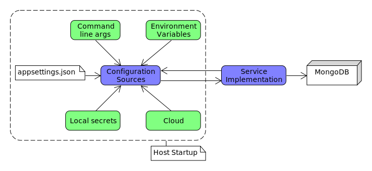
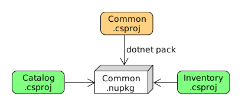

# .NET Microservices – Full Course for Beginners
## by Julio Casal

Learn the foundational elements of a microservices architecture with .NET in this beginner level course. You will incrementally building a real microservices-based application with the .NET platform and C#.

Video tutorial: https://www.youtube.com/watch?v=CqCDOosvZIk

## Monolith vs microservices
### Monolith pros and cons
Pros:
- Convenient for new projects
- Tools mostly focused on them
- Great code reuse
- Easier to run locally
- Easier to debug and troubleshoot
- One thing to build
- One thing to deploy
- One thing to test end-to-end
- One thing to scale
Cons:
- Easily gets too complex to understand
- Merging code can be challenging
- Slows down IDEs
- Long build times
- Slow and infrequent deployments
- Long testing and stabilization periods
- Rolling back is all or nothing
- No isolation between modules
- Can be hard to scale
- Hard to adopt new tech

### What are microservices?
An architectural style that structures an application as a collection of independently deployable services that are modeled around a business domain and are usually owned by a small team.
Pros:
- Small, easier to understand code base
- Quicker to build
- Independent, faster deployments and rollbacks
- Independently scalable
- Much better isolation from failures
- Designed for continuous delivery
- Easier to adopt new, varied tech
- Grants autonomy to teams and lets them to work in parallel

Cons
- Not easy to find the right set of services
- Adds the complexity of distributed systems
- Shared code moves to separate libraries
- Releasing features accross services is hard
- Hard to troubleshoot issues accross services
- Can't use transactions accross services
- Raises the required skillset for the team

When should you move to microservices?
- The code base is more than a small team can maintain
- Teams can't move fast anymore
- Builds become too slow due to large code base
- Time to market is compromised due to infrequent deployments and long verification times

## REST API
A REST api defines the operations exposed by a microservice.

A Data Transfer Object (DTO) is an object that carries data between processes. The DTO represents the _contract_ between the microservice API and the client.

### ASP.NET Core Configuration

### Postman
The OpenAPI specification (`/swagger/v1/swagger.json`) can be imported into Postman as a collection.

### Reusing common code

- Don't repeat yourself (DRY)
- Microservices should be independent of each other
- Each microservice should live in its own repository
- NuGet is the package manager for .NET
- A NuGet file is a single ZIP file (.nupkg) that contains files to share with others
- Microservice project don't need to know where NuGet packages are hosted
- The common code is now maintained in one place
- The time to build new microservices is significantly reduced

**NOTE**: Not implementing NuGet packaging for commmon code due to hosting issues. Instead, the Playstore.Common project will be referenced by other microservices.