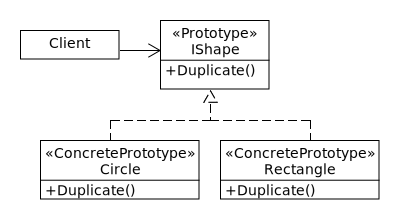

# Prototype Pattern
The prototype pattern is a creational design pattern that allows objects to be copied or cloned providing a mechanism to create new instances by copying existing objects without explicitly invoking their constructors, and it is used to efficiently produce new instances with idetyical properties to existing objects.

**Example**: Say that we have a GUI that allows users to create new shapes on the screen, such as circles or rectangles. When the user right-clicks on a shape an actions menu upens up. The user can then select 'Duplicate' to clone the shape.

