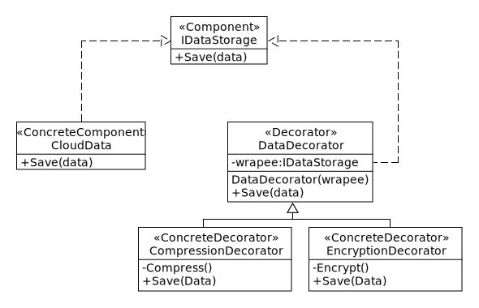

# Decorator Pattern
The Decorator pattern is a structural design pattern that allows behavior to be added to individual objects dynamically, enhancing functionality without altering the object's structure, and it's used to extend or modify the behavior of objects by wrapping them with additional functionality through composition.

**Example**: Say that we have an application that allows users to store data in the cloud. The data can be sent to the cloud as-is, without processing, and it can also be compressed and/or encrypted before it is sent to the cloud.

