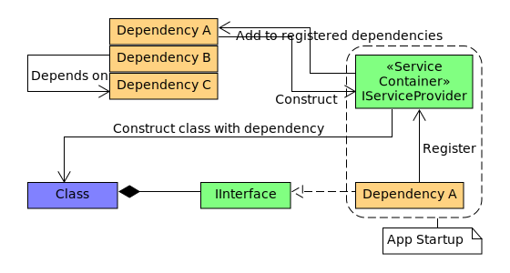
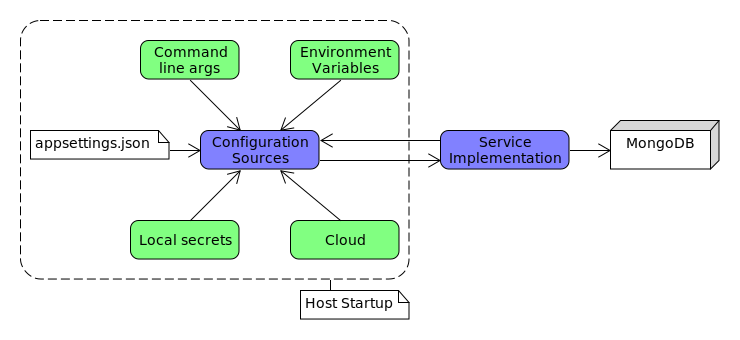
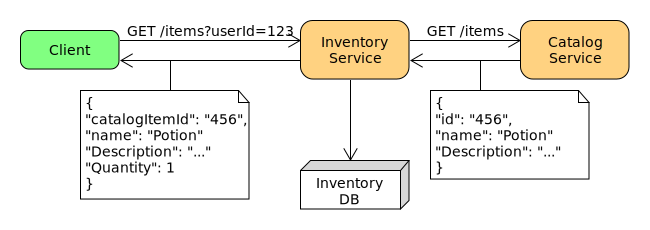
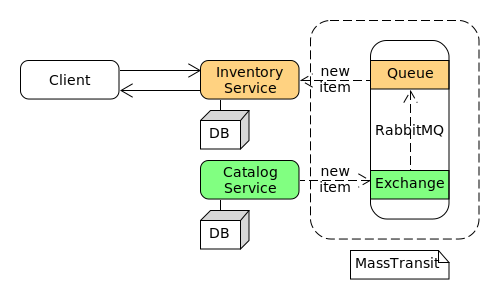

# Course summary
- [Monolith vs microservices](#monolith-vs-microservices)
- [REST API](#rest-api)
    - [Dependency Injection](#dependency-injection)
    - [Developer certificates](#developer-certificates)
    - [ASP.NET Core Configuration](#aspnet-core-configuration)
    - [Postman](#postman)
    - [Reusing common code](#reusing-common-code)
    - [Synchronous communication](#synchronous-communication)
        - [Microservice resilience](#microservice-resilience)
    - [Asynchronous communication](#asynchronous-communication)

# Monolith vs microservices
## Monolith pros and cons
Pros:
- Convenient for new projects
- Tools mostly focused on them
- Great code reuse
- Easier to run locally
- Easier to debug and troubleshoot
- One thing to build
- One thing to deploy
- One thing to test end-to-end
- One thing to scale

Cons:
- Easily gets too complex to understand
- Merging code can be challenging
- Slows down IDEs
- Long build times
- Slow and infrequent deployments
- Long testing and stabilization periods
- Rolling back is all or nothing
- No isolation between modules
- Can be hard to scale
- Hard to adopt new tech

## What are microservices?
An architectural style that structures an application as a collection of independently deployable services that are modeled around a business domain and are usually owned by a small team.  

Pros:
- Small, easier to understand code base
- Quicker to build
- Independent, faster deployments and rollbacks
- Independently scalable
- Much better isolation from failures
- Designed for continuous delivery
- Easier to adopt new, varied tech
- Grants autonomy to teams and lets them to work in parallel

Cons
- Not easy to find the right set of services
- Adds the complexity of distributed systems
- Shared code moves to separate libraries
- Releasing features accross services is hard
- Hard to troubleshoot issues accross services
- Can't use transactions accross services
- Raises the required skillset for the team

When should you move to microservices?
- The code base is more than a small team can maintain
- Teams can't move fast anymore
- Builds become too slow due to large code base
- Time to market is compromised due to infrequent deployments and long verification times

# REST API
A REST api defines the operations exposed by a microservice.

A Data Transfer Object (DTO) is an object that carries data between processes. The DTO represents the _contract_ between the microservice API and the client.

## Dependency Injection

## Developer certificates
Generate SSL dev cert ([see doc](https://learn.microsoft.com/en-us/dotnet/core/tools/dotnet-dev-certs)): `dotnet dev-certs https`.  
Trust dev certs ([see doc](https://learn.microsoft.com/en-us/aspnet/core/security/enforcing-ssl?view=aspnetcore-8.0&tabs=visual-studio%2Clinux-ubuntu%2Clinux-sles#trust-the-aspnet-core-https-development-certificate-on-windows-and-macos)): `dotnet dev-certs https --trust`.  
View certificates: `ls -la ~/.dotnet/corefx/cryptography/x509stores/my`.  
Cannot trust dev cert on Linux. Use `ASPNETCORE_URLS` environment variable to disable HTTPS redirect ([see doc](https://learn.microsoft.com/en-us/aspnet/core/security/enforcing-ssl?view=aspnetcore-8.0&tabs=visual-studio%2Clinux-ubuntu%2Clinux-sles)): 

## ASP.NET Core Configuration

## Postman
A .NET microservice's OpenAPI specification (`/swagger/v1/swagger.json`) can be imported into Postman to generate a collection.

## Reusing common code

- Don't repeat yourself (DRY)
- Microservices should be independent of each other
- Each microservice should live in its own repository
- NuGet is the package manager for .NET
- A NuGet file is a single ZIP file (.nupkg) that contains files to share with others
- Microservice project don't need to know where NuGet packages are hosted
- The common code is now maintained in one place
- The time to build new microservices is significantly reduced

Generate NuGet package: `dotnet pack -p:PackageVersion=1.0.1 -o package/`

**NOTE**: Not implementing NuGet packaging for commmon code due to hosting limitations with Docker. Instead, the Playstore.Common project will be referenced by other microservices.

## Synchronous communication
- The client sends a request and waits for the response from the service
- The client cannot proceed without the response
- The client may use a blocking or non-blocking implementation
- Rest + HTTP protocol is the traditional approach
- gRPC is an increasingly popular approach for internal inter-service communication (using HTTP2)

### Microservice Resilience
**Timeout policy**  

**Retry policy**  
Retries with exponential backoff  

**Circuit Breaker**  

## Asynchronous communication
- The client does not wait for a response in a timely manner
- There might be no response at all
- Usually involves the use of a message broker
- Message broker has high availability
- Messages are sent to the message broker and can be received by: 
    - A single receiver (asynchronous commands)
    - Multiple receivers (publish/subscribe events)
- Partial failures are no longer propagated
- Independent service SLA
- Microservice autonomy enforced

