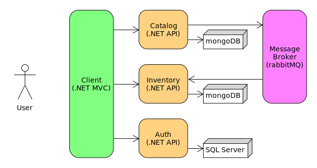

# .NET Microservices – Full Course for Beginners
## by Julio Casal

Learn the foundational elements of a microservices architecture with .NET in this beginner level course. You will incrementally building a real microservices-based application with the .NET platform and C#.

## Resources
- Video tutorial: https://www.youtube.com/watch?v=CqCDOosvZIk
- Authentication / authorization functionality: https://www.youtube.com/watch?v=Nw4AZs1kLAs

## Project
- .NET 6 WebAPI microservices
- .NET 6 authentication / authorization microservice using .NET Core identity
- .NET 6 MVC client
- SQL Server for auth service
- MongoDB storage
- Microservice client resilience using Polly
- Asynchronous communication using RabbitMQ
- Unit testing using MSTest and Moq
- Docker for containerization

